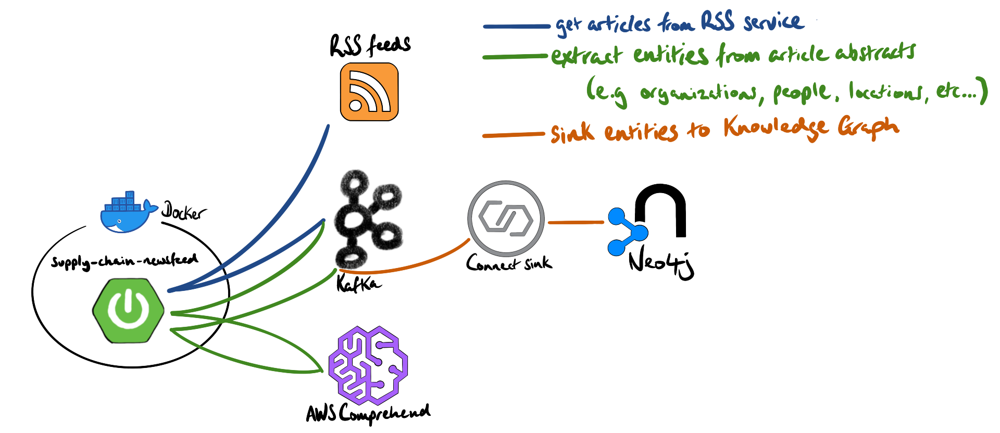

# supply-chain-newsfeed

This Dockerized microservice polls RSS feeds, performs entity resolution on the article abstracts using AWS Comprehend, and then publishes the resolved entities to a Kafka topic (`sc-article-entity`).

We created this, specifically, to build a supply-chain knowledge graph so we can understand the relationships between organizations, locations, events, etc...

    mvn spring-boot:build-image -Dspring-boot.build-image.imageName=alexwoolford/supply-chain-newsfeed:1.0.1

This service uses two topics:
1. `sc-article`: keyed by article URL, compacted
2. `sc-article-entity`

Here's an example of an `sc-article` message value:

    {
        "link":"https://www.supplychaindive.com/news/simply-good-foods-commodities-mergers-acquisitions/617133/",
        "title":"Simply Good Foods increases prices to cover rising ingredients costs",
        "description":"The seller of Atkins and Quest Nutrition products has faced inflation \"from the high single digits to the low double digits for our total business,\" its CFO said.",
        "timestamp":1642103160900
    }

The microservice takes messages from `sc-article`, extracts the entities (e.g. people, places, organizations, etc...), and published the entities to `sc-article-entity`:

    {
      "link":"https://www.supplychaindive.com/news/simply-good-foods-commodities-mergers-acquisitions/617133/",
      "entityType":"Person",
      "entityValue":"CFO",
      "timestamp":1642103160900
    }
    ********
    {
        "link":"https://www.supplychaindive.com/news/simply-good-foods-commodities-mergers-acquisitions/617133/",
        "entityType":"Organization",
        "entityValue":"Atkins",
        "timestamp":1642103160900
    }
    ********
    {
        "link":"https://www.supplychaindive.com/news/simply-good-foods-commodities-mergers-acquisitions/617133/",
        "entityType":"Organization",
        "entityValue":"Quest Nutrition",
        "timestamp":1642103160900
    }

Put the configuration in a file, e.g. `snowplow-neo4j-sink.json`:

    {
        "connector.class": "streams.kafka.connect.sink.Neo4jSinkConnector",
        "key.converter": "org.apache.kafka.connect.storage.StringConverter",
        "name": "sc-article-entity-neo4j",
        "neo4j.authentication.basic.username": "neoadmin",
        "neo4j.authentication.basic.password": "V1ctoria",
        "neo4j.server.uri": "neo4j://neo4j.woolford.io:7687",
        "neo4j.topic.cypher.sc-article-entity": "CALL apoc.cypher.doIt(\"MERGE(a:Article {link: '\" + event.link + \"'}) MERGE(e:\" + event.entityType + \") SET e.text = '\" + event.entityValue + \"' MERGE(a)-[:HAS_ENTITY {timestamp: \" + event.timestamp + \"}]->(e)\", {}) YIELD value RETURN value",
        "neo4j.database": "supplychainkg",
        "topics": "sc-article-entity",
        "value.converter": "org.apache.kafka.connect.json.JsonConverter",
        "value.converter.schemas.enable": "false"
    }

Submit the connector:

    http PUT snowplow.woolford.io:8083/connectors/sc-article-entity-neo4j/config < snowplow-neo4j-sink.json

